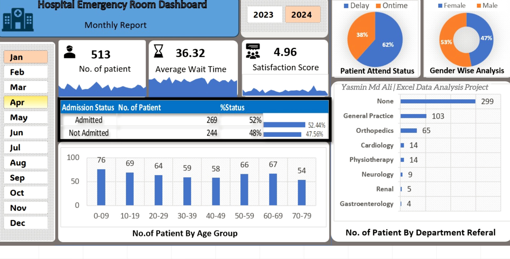
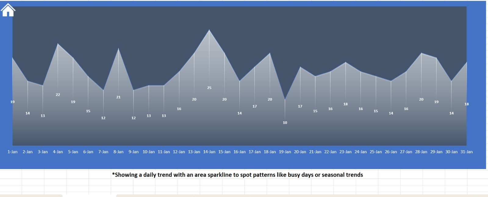
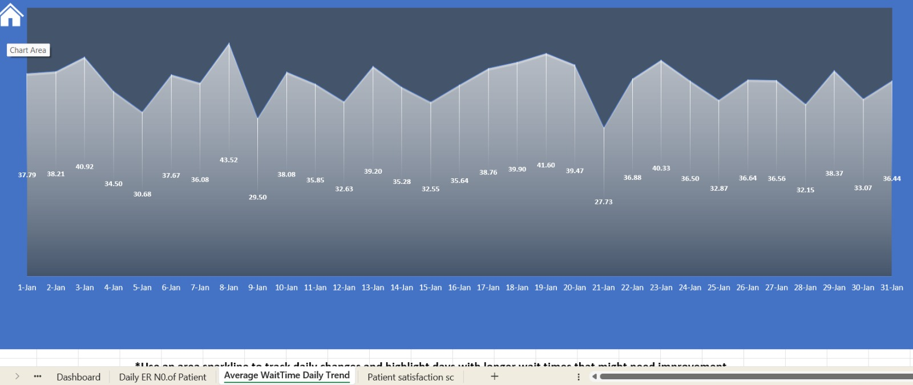
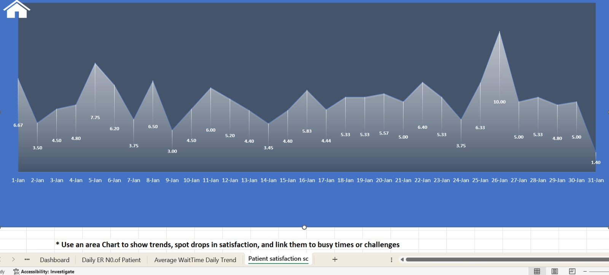

# Hospital Emergency Room (ER) Dashboard

An operational healthcare analytics dashboard built in Excel to monitor and evaluate Emergency Room performance, patient throughput, and service quality. This project focuses on tracking patient demographics and clinical wait times to help optimize hospital resource allocation.

## 📊 Key Metrics & Insights
* **Total Patients Tracked:** 513
* **Average ER Wait Time:** 36.32 minutes
* **Average Patient Satisfaction Score:** 4.96 / 10
* **Admission Conversion Rate:** 52% Admitted (269 patients) vs 48% Not Admitted (244 patients)

## 📈 Features & Visualizations
* **Patient Attendance Status:** Donut chart analyzing operational response efficiency, showing 62% Ontime vs 38% Delay in patient care.
* **Demographic Breakdown:** Dual analysis tracking Gender-Wise Distribution (53% Male vs 47% Female) and a column chart separating patient volume across distinct Age Groups (led by the 0-9 childhood bracket at 76 patients).
* **Clinical Department Referrals:** Horizontal ranking chart showing where ER patients are directed, with General Practice (103) and Orthopedics (65) taking the highest volume outside of unassigned cases.
* **Temporal Filters:** Interactive timelines allowing cross-filtering by Year (2023, 2024) and individual calendar Months.

## 🛠️ Tools Used
* **Microsoft Excel:** Advanced Data Modeling, Pivot Tables, Conditional Formatting, Interactive Slicers, and Healthcare KPI Dashboard Design.

## 📂 How to Use
1. Download or clone the repository.
2. Open the `.xlsx` file in Microsoft Excel.
3. Use the interactive calendar slicer on the left and the year selector at the top to filter ER operational metrics for specific periods.
